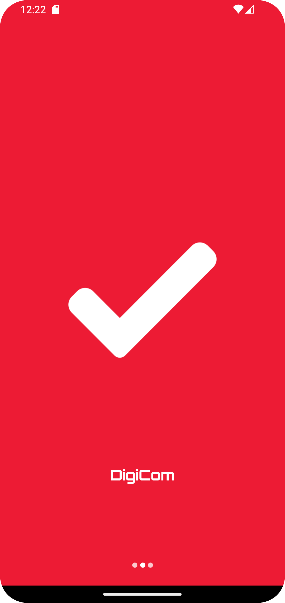
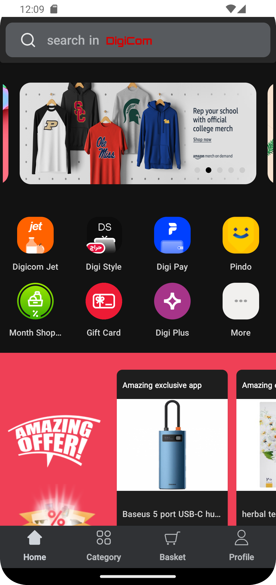
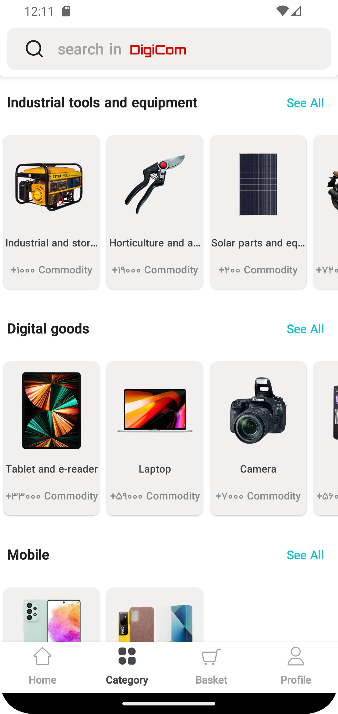
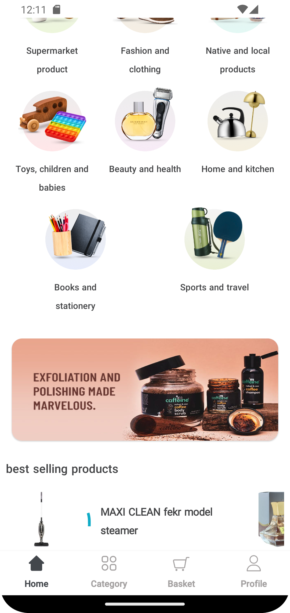

# DigiCom

An application similar to Digikala that has all its features.

> I am developing it

##### Screenshot
<table>
  <tr>
    <td></td>
    <td></td>
    <td></td>
    <td></td>
    <td></td>
  </tr>
 </table>

##### The following technologies are used to develop this application:
```
Kotlin
Jetpack Compose
DataStore
Coroutines
Flow
Dagger Hilt
Design Pattern MVVM
RoomDB
Compose Navigation
.
.
.
```

#### Features

- [x] Add Navigation Compose
- [x] Add Multi Language
- [x] Add Multi Theme
- [x] Add Bottom Navigation
- [x] Add Splash Screen
- [x] Add Top Slider
- [x] Add SearchBar
- [x] Add Swipe Refresh
- [x] Add Other Item Home Page
- [x] Add Category Page
- [x] Add RoomDb
- [x] Add BasketCart Page
- [ ] Add Profile Page
- [ ] .
- [ ] .
- [ ] .